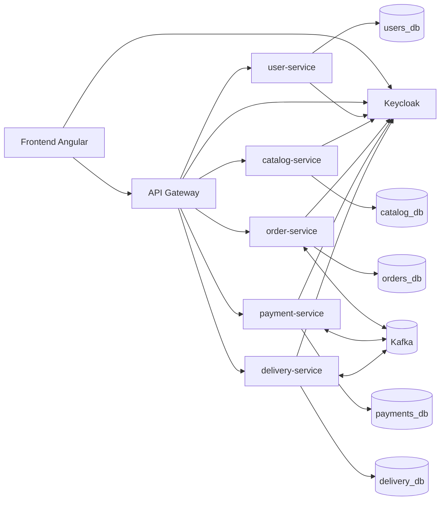
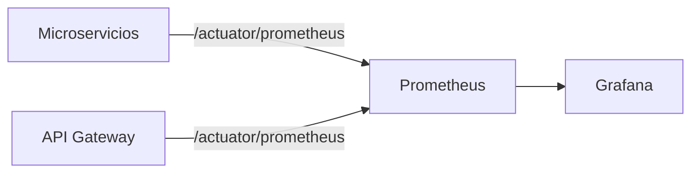

# Documentacion final del proyecto

## 1. Arquitectura general

El sistema implementa una arquitectura de microservicios con separacion por dominio de negocio y base de datos por servicio.

- `api-gateway`: punto de entrada unico para frontend y clientes.
- `user-service`: perfil y direcciones del usuario.
- `catalog-service`: restaurantes y productos.
- `order-service`: creacion y consulta de pedidos.
- `payment-service`: aprobacion/rechazo de pago.
- `delivery-service`: ciclo de entrega.
- `frontend` (Angular): interfaz web para el usuario.

### Diagrama de componentes

### Capas por microservicio (backend)

- `presentation`: controllers, DTOs, manejo de errores.
- `application`: servicios de aplicacion y casos de uso.
- `domain`: entidades, reglas de negocio, puertos.
- `infrastructure`: persistencia, mensajeria, clientes externos, config.

## 2. Integracion entre servicios

### Integracion sincrona (HTTP)

- Frontend -> API Gateway (REST).
- API Gateway -> microservicios (ruteo por path).
- `order-service` -> `catalog-service` para validar productos/precios.

### Integracion asincrona (Kafka)

- `order-service` publica `payment.requested`.
- `payment-service` consume `payment.requested` y publica:
  - `payment.approved`
  - `payment.rejected`
- `delivery-service` consume `payment.approved` y publica:
  - `delivery.assigned`
  - `delivery.started`
  - `delivery.delivered`
- `order-service` consume resultados de pago y progreso de entrega para consolidar estado final del pedido.

### Trazabilidad y resiliencia

- Correlation ID propagado por HTTP y Kafka.
- Reintentos, backoff, DLQ en consumidores.
- Circuit breaker para dependencias sincrona criticas.

## 3. Dependencias principales y por que se usan

- **Spring Boot**: base de ejecucion y auto-configuracion.
- **Spring WebMVC / WebFlux**: APIs REST y gateway reactivo.
- **Spring Security OAuth2 Resource Server**: validacion JWT emitido por Keycloak.
- **Spring Data JPA + PostgreSQL**: persistencia por microservicio.
- **Flyway**: versionado y migraciones de schema.
- **Spring Kafka**: mensajeria asincrona por eventos.
- **Spring Cloud OpenFeign**: cliente HTTP declarativo entre microservicios.
- **Resilience4j**: circuit breaker y tolerancia a fallos.
- **Springdoc OpenAPI**: documentacion Swagger de APIs.
- **Actuator + Micrometer + Prometheus**: salud y metricas operativas.
- **JUnit + Mockito + Testcontainers**: pruebas unitarias e integracion.

## 4. Como correr en local

Resumen ejecutivo:

1) Levantar infraestructura con Docker Compose.
2) Construir imagenes locales de microservicios/frontend.
3) Desplegar en Kubernetes local (Docker Desktop) uno por uno.
4) Exponer por `port-forward`.

Comandos detallados y troubleshooting en `k8s/README.md` y resumen rapido en `README.md`.

## 5. Como probar

### Pruebas automatizadas

- Backend CI en GitHub Actions:
  - tests de los 6 microservicios backend
  - build de frontend

### Pruebas locales recomendadas

- `./mvnw test` por servicio backend.
- `npm run build` en frontend.
- Validar endpoint health del gateway:
  - `http://localhost:8000/actuator/health`

### Escenarios funcionales minimos

1. Flujo feliz: crear pedido -> aprobar pago -> completar delivery.
2. Pago rechazado: verificar transicion de estado de pedido.
3. Restaurante inactivo o producto invalido: validar rechazo en creacion de pedido.

## 6. Decisiones y trade-offs

### Decisiones

- Arquitectura por microservicios con DB por servicio.
- Integracion orientada a eventos para pago/entrega.
- Gateway unico para simplificar frontend y seguridad.
- OAuth2/JWT con Keycloak centralizado.
- Kubernetes local para entorno de demostracion rapido.

### Trade-offs

- **Pros**: desacoplamiento, escalabilidad por dominio, trazabilidad por eventos.
- **Contras**: mayor complejidad operativa (Kafka, observabilidad, seguridad distribuida).
- **Pros**: tests y CI robustos mejoran calidad continua.
- **Contras**: tiempo de pipeline y mantenimiento de contratos de eventos.
- **Pros**: Kubernetes local reduce costo para demo.
- **Contras**: estabilidad depende de recursos de la laptop y Docker Desktop.

## 7. Observabilidad minima (Actuator + Prometheus + Grafana)

- Todos los servicios exponen `health/info/prometheus` por Actuator.
- Prometheus scrapea endpoints `/actuator/prometheus`.
- Grafana consulta Prometheus para visualizar estado y rendimiento.
- Grafana queda preconfigurado por provisioning:
  - datasource: `Prometheus`
  - dashboard: `Food Ordering - Basic Observability` (JSON en `config/grafana/dashboards/food-ordering-basic.json`)

Flujo:

Validacion minima:

- Abrir Prometheus: `http://localhost:9090`
- Abrir Grafana: `http://localhost:3000` (`admin/admin` o password configurado)
- Verificar que exista la carpeta `Food Ordering` con el dashboard cargado automaticamente.
- Consultas utiles:
  - `up`
  - `jvm_memory_used_bytes`
  - `http_server_requests_seconds_count`

Si cambias dashboards/provisioning y no se refleja de inmediato:

- `docker compose -f infra/local/docker-compose.yml up -d --force-recreate grafana`
